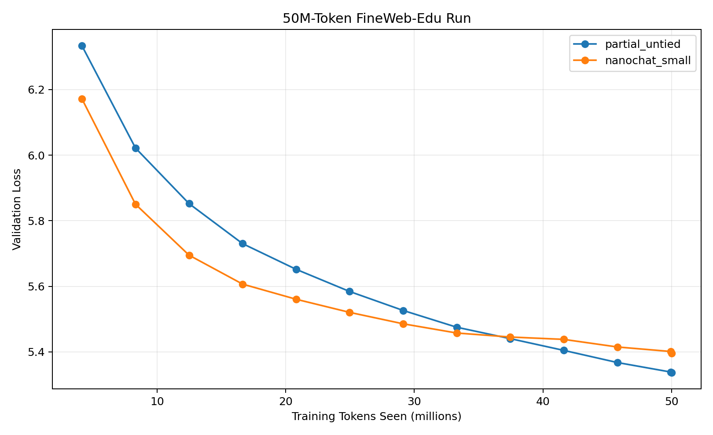
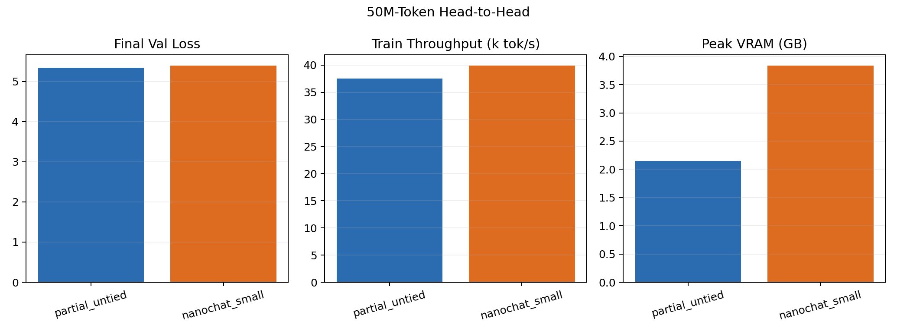
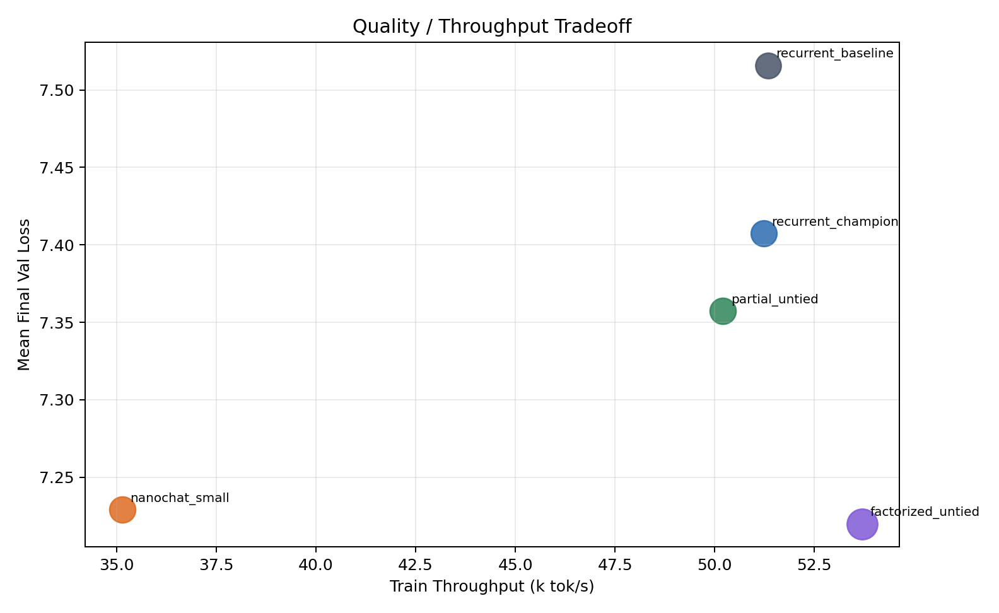
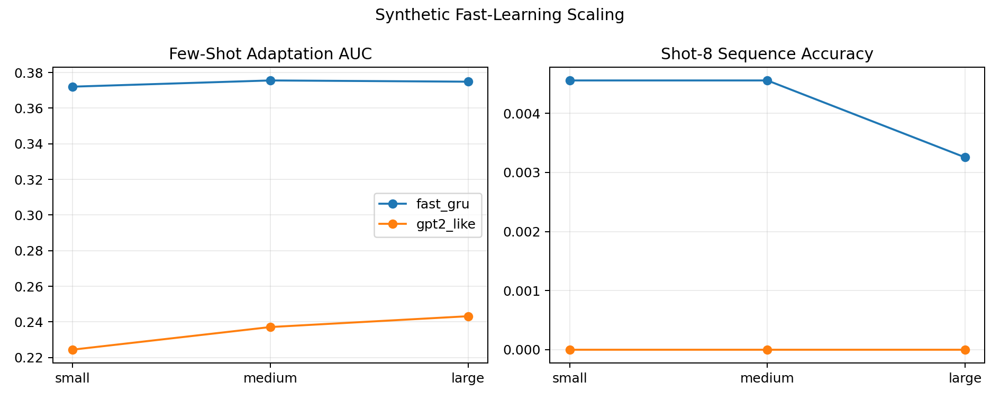

# RESEARCH-1

Recurrent memory language models versus a Nanochat-style small-transformer baseline under shared small-scale training budgets.

## TL;DR

- This repo preserves the full code and benchmark artifact trail for the language-architecture experiments developed in `arc_tactic3`, with a focus on stateful recurrent memory models.
- In the matched 50M-token FineWeb-Edu watch runs, `partial_untied` finished with lower validation loss than the Nanochat-style baseline: `5.3370` vs `5.3958`, while using much less VRAM: `2201.9 MB` vs `3931.2 MB`.
- Nanochat remained somewhat faster in raw training throughput in the 50M run: `39.9k tok/s` vs `37.5k tok/s`.
- In the synthetic fast-learning scaling benchmark, the recurrent `fast_gru` family beat the GPT-2-like baseline at every tested scale on adaptation AUC.
- Many candidate branches produced short-run gains that did not survive longer holds. Those negative results are included here on purpose.

## What This Repo Contains

This repo is structured around one main research question:

> Can a recurrent memory architecture match or beat a Nanochat-style small language model at similar parameter counts and modest training budgets while preserving a stronger stateful-memory bias?

It includes:

- the language-model comparison code from `arc_tactic3/`
- the benchmark artifacts that support the current claims
- generated figures and summary tables
- negative-result artifacts for failed or inconclusive architecture branches

There is also some ARC/agent code preserved in `arc_tactic3/` because it is part of the same research workspace, but the README is scoped to the language-model memory comparison work.

## Main Results

### 50M-token head-to-head

| Model | Params | Final val loss | Train tok/s | Pure train tok/s | Peak VRAM |
| --- | ---: | ---: | ---: | ---: | ---: |
| `partial_untied` | 8,069,555 | 5.3370 | 37.5k | 38.5k | 2201.9 MB |
| `nanochat_small` | 8,125,570 | 5.3958 | 39.9k | 41.5k | 3931.2 MB |

Source artifacts:

- [`partial_untied` final run](./artifacts/watch_runs/partial_untied_watch_50m_20260328/final.json)
- [`nanochat_small` final run](./artifacts/watch_runs/nanochat_watch_50m_20260328_retry2/final.json)





### Recurrent-family progression

In the recurrent-only fair comparison sweep, the current strongest near-budget line is `partial_untied`, which improved over the older recurrent champion:

| Model | Params | Mean final val loss | Mean train tok/s |
| --- | ---: | ---: | ---: |
| `recurrent_baseline` | 7,787,379 | 7.5159 | 51.3k |
| `recurrent_champion` | 7,995,315 | 7.4073 | 51.2k |
| `partial_untied` | 8,143,795 | 7.3573 | 50.2k |
| `factorized_untied` | 11,220,979 | 7.2199 | 53.7k |
| `nanochat_small` | 8,125,570 | 7.2290 | 35.1k |

Primary artifact:

- [`language_recurrent_nano_tricks_fair_20260327.json`](./artifacts/benchmark_runs/language/language_recurrent_nano_tricks_fair_20260327.json)



### Synthetic fast-learning scaling

The recurrent `fast_gru` family outperformed the GPT-2-like baseline at every tested scale on adaptation AUC and was the only family to achieve non-zero exact sequence completion in this benchmark suite.

| Scale | `fast_gru` AUC | `gpt2_like` AUC | `fast_gru` shot-8 seq acc | `gpt2_like` shot-8 seq acc |
| --- | ---: | ---: | ---: | ---: |
| Small | 0.3721 | 0.2244 | 0.00456 | 0.00000 |
| Medium | 0.3756 | 0.2371 | 0.00456 | 0.00000 |
| Large | 0.3749 | 0.2432 | 0.00326 | 0.00000 |

Primary artifact:

- [`language_fastlearn_scaling_gpt2icl_hybrid_20260327.json`](./artifacts/benchmark_runs/language/language_fastlearn_scaling_gpt2icl_hybrid_20260327.json)



## Key Findings

- A small recurrent memory architecture can be competitive with, and in some settings beat, a Nanochat-style small transformer at similar parameter counts.
- The best current recurrent line is not the original baseline. `partial_untied` appears to be the strongest stable recurrent variant in this repo.
- Nanochat-style models remain attractive on raw throughput, but their VRAM cost is much higher in the local experiments preserved here.
- The architecture search contained a large number of negative results. Short-budget wins frequently disappeared under longer holds, which is why the negative artifacts are preserved.
- The strongest architecture insight from the later GPU work is that stateful memory seems valuable, but naive dense memory writeback paths are inefficient. Several compact or chunked-memory variants looked promising early and then failed to hold.

## Negative Results And Failed Directions

Representative negative or non-promoted lines:

- `local_global_memory`
- `learned_compressor`
- `slot_memory`
- `dynamic_token_basis`
- compact shortlist-memory rewrites
- chunked token-memory rewrites that looked good on cheap probes but failed longer holds

See:

- [`docs/negative_results.md`](./docs/negative_results.md)

## Experimental Setup

Common setup across much of the language suite:

- cached FineWeb-Edu GPT-2-tokenized blocks
- sequence length `127`
- shared training harness and optimizer family (`AdamW`)
- single-GPU local hardware for the preserved headline runs
- most of the long-form runs were executed on an RTX 2080 SUPER with AMP enabled

The benchmark scripts themselves are in:

- [`arc_tactic3/language_realtext_microbench.py`](./arc_tactic3/language_realtext_microbench.py)
- [`arc_tactic3/language_nanochat_actual_compare.py`](./arc_tactic3/language_nanochat_actual_compare.py)
- [`arc_tactic3/language_partial_untied_watch.py`](./arc_tactic3/language_partial_untied_watch.py)
- [`arc_tactic3/language_nanochat_watch.py`](./arc_tactic3/language_nanochat_watch.py)

## Limitations

- This is a research repo, not a final benchmark suite.
- Some results are 2-seed averages, some are 1-seed long runs, and some are smoke or cheap-screen artifacts.
- The Nanochat baseline is a local Nanochat-style reimplementation and training harness, not the official upstream training codepath.
- Large derived dataset caches were not committed directly when that would create impractical or GitHub-incompatible artifacts.
- Some code in `arc_tactic3/` is unrelated to the central language-model comparison and is preserved for completeness rather than because it is part of the README’s core claims.

## Reproduce

Generate the figures and summary tables from the preserved artifacts:

```bash
python scripts/build_figures.py
```

Watch a long run live during training:

```bash
python -m arc_tactic3.language_partial_untied_watch --watch-dir artifacts/watch_runs/partial_untied_watch_50m_20260328
python -m arc_tactic3.language_nanochat_watch --watch-dir artifacts/watch_runs/nanochat_watch_50m_20260328_retry2
```

Launch the current best candidate (`partial_untied`) on an A100 or H100 with automatic hardware defaults, FineWeb-Edu streaming/cache build, checkpoints, live progress, and fixed-prompt samples:

```bash
python -m arc_tactic3.language_partial_untied_cluster \
  --output-dir runs/partial_untied_cluster_h100 \
  --device cuda
```

To inspect the resolved hardware-tuned config before running:

```bash
python -m arc_tactic3.language_partial_untied_cluster \
  --output-dir runs/partial_untied_cluster_h100 \
  --device cuda \
  --print-config
```

To watch an active cluster run from another shell:

```bash
python -m arc_tactic3.language_partial_untied_cluster \
  --target-watch-dir runs/partial_untied_cluster_h100 \
  --watch-once
```

Key benchmark and experiment sources live under:

- [`arc_tactic3/`](./arc_tactic3)
- [`artifacts/benchmark_runs/language/`](./artifacts/benchmark_runs/language)
- [`artifacts/watch_runs/`](./artifacts/watch_runs)

## Repo Layout

```text
arc_tactic3/                 Research code and tests copied from the working repo
artifacts/benchmark_runs/    JSON artifacts for benchmark suites and ablations
artifacts/watch_runs/        Long-run watch outputs for 50M-token comparisons
figures/                     Generated PNG figures for the README
docs/                        Negative results, summaries, and artifact notes
scripts/                     Utility scripts, including figure generation
```

## Status

This repository is an active research snapshot. The strongest current public claim supported by the preserved artifacts is narrow:

> At roughly 8M parameters and 50M training tokens on cached FineWeb-Edu blocks, the `partial_untied` recurrent model finished with lower validation loss and much lower VRAM than the local Nanochat-style small baseline, while Nanochat retained somewhat higher raw throughput.
