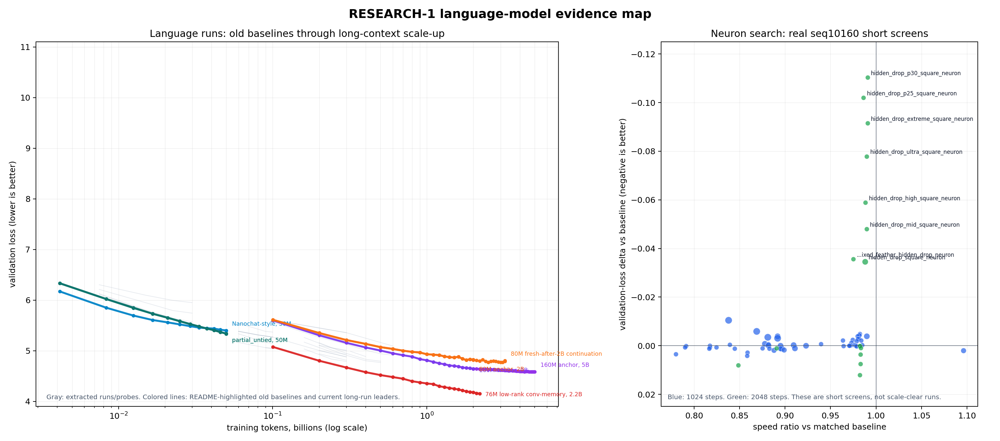
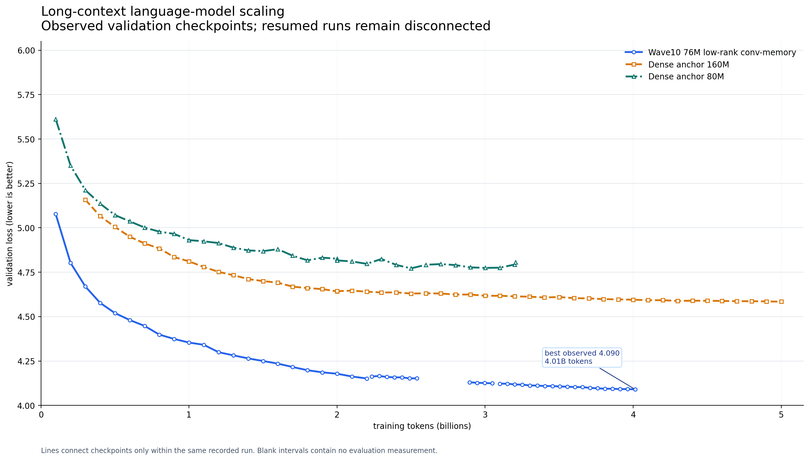
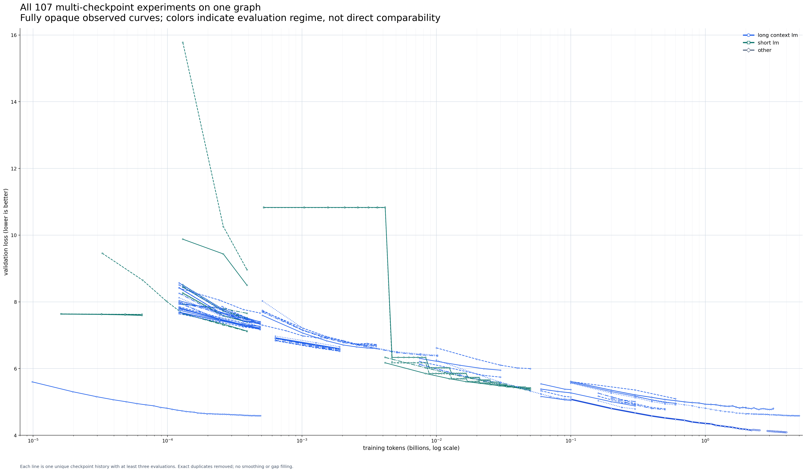

# RESEARCH-1

Local language-model architecture research focused on long-context, linear-sequence alternatives to small transformer baselines.

The current best family in this snapshot is **causal multi-scale low-rank conv-memory**: causal depthwise convolutions, low-rank causal memory, and a squared-activation FFN. Across the preserved direct and resumed histories, the strongest observed checkpoint is the 76M-parameter Wave10 line at 4.01B tokens with validation loss about `4.090`.

This repository is an artifact trail, not a polished benchmark paper. It preserves code, logs, plots, JSON/CSV summaries, negative results, and short-screen neuron experiments so claims can be checked instead of reconstructed from memory.

## Current Picture



The complete repository-wide analysis is now in [`research_analysis_20260814`](./artifacts/benchmark_runs/language/research_analysis_20260814/). It rescans every result JSON/JSONL/CSV and recognized log, preserves all extracted points, classifies incompatible regimes, and writes separate views for exhaustive loss curves, major long runs, parameter scale, throughput, the empirical frontier, synthetic fast-learning scaling, and neuron-search tradeoffs.

Open the self-contained [Research Scaling Atlas HTML report](./artifacts/benchmark_runs/language/research_analysis_20260814/html_report_20260815/report.html) for combined views plus clean graphs split into seven training-token horizons. It covers 107 unique multi-checkpoint histories, 84 long-context histories, architecture-family evidence, neuron tradeoffs, synthetic fast-learning results, methodology, limitations, and the next controlled experiment.



The broad single-canvas view below overlays every deduplicated experiment with at least three validation checkpoints. Lines are fully opaque; color separates evaluation regimes, which should not be treated as directly comparable metrics.



For the broad experiment history, open the [multipage experiment curve atlas](./artifacts/benchmark_runs/language/research_analysis_20260814/experiment_curve_atlas.pdf). It gives every unique experiment with at least three recorded validation checkpoints its own opaque, labeled panel; the [atlas index](./artifacts/benchmark_runs/language/research_analysis_20260814/experiment_curve_atlas_index.csv) maps each panel back to its source.

Generated from:

- [`curve_summary.csv`](./artifacts/benchmark_runs/language/research_curves_20260614/curve_summary.csv)
- [`extracted_points.csv`](./artifacts/benchmark_runs/language/research_curves_20260614/extracted_points.csv)
- [`neuron_search_summary.csv`](./artifacts/benchmark_runs/language/research_curves_20260614/neuron_search_summary.csv)

Extraction scope:

- `1,585` validation-loss points
- `696` distinct extracted curves
- `74` aggregated real-sequence neuron-search rows
- old 50M-token `partial_untied` and NanoChat-inspired mini-port watch runs
- long-sequence anchor scaling runs
- local/house GPU wave runs
- manual neuron-search screens

The dated analysis contains `3,464` deduplicated validation-loss points across `824` curves, plus `30` synthetic fast-learning rows and `74` neuron-search summaries. The all-points table deliberately retains incompatible tokenizers, objectives, contexts, and validation sets; the colored regime labels are a comparability warning, not a claim that all losses form one scaling law.

The left panel shows absolute validation loss versus training tokens. The right panel shows short neuron-search deltas versus matched baselines, where negative means the candidate beat its baseline.

## TL;DR

- The best mature recorded family is Wave10 76M low-rank conv-memory. Its direct run reached `4.1517` at 2.20B tokens, and preserved resume segments later reached about `4.090` at 4.01B tokens.
- Scaling the older dense anchor larger did not beat it. The 160M 5B-token anchor ended at `4.5841`; the 160M 2B-token run ended at `4.6422`.
- The older 80M anchor line reached around `4.82` at 2B tokens; its later fresh-after-2B continuation briefly reached `4.7715` best validation loss but ended at `4.8059`.
- The original 8M-parameter `partial_untied` result is still real inside its matched local harness: it beat the local NanoChat-inspired mini-port at 50M token exposures (`5.3370` vs `5.3958`) with lower VRAM. This was not a replication of Karpathy's official NanoChat training system.
- The neuron search found real short-screen signals, but no candidate is scale-cleared. The best multi-seed signal is rank-competition/memory coupling; the best 2048-step hidden-drop rows are strong but still short-screen evidence.
- Simple activation swaps were not the answer. Plain SwiGLU and SiLU-square were already tested and were not promoted.

## Long-Run Leaderboard

These rows are the clearest long-run comparisons currently extracted. They are not all the same exact hardware path, but they use the same next-token validation objective and are useful for ranking the local research lines.

| Line | Tokens | Final val loss | Best val loss | Notes |
| --- | ---: | ---: | ---: | --- |
| `76M low-rank conv-memory` | `2.200B` | `4.1517` | `4.1517` | Current standout; 3080 run from wave10 family. |
| `160M anchor, 5B` | `5.000B` | `4.5841` | `4.5841` | Much longer run, but worse than the 76M low-rank conv-memory line. |
| `160M anchor, 2B` | `2.000B` | `4.6422` | `4.6422` | Larger dense anchor did not close the gap. |
| `80M fresh-after-2B continuation` | `3.205B` | `4.8059` | `4.7715` | Best checkpoint was earlier than the final point. |
| `80M anchor, 2B` | `2.000B` | `4.8262` | `4.8169` | Earlier 80M baseline. |
| `40M anchor, 600M` | `600M` | about `5.05` | about `5.05` | Useful scale reference, not a leader. |

The important result is not just "more tokens helped." The 76M low-rank conv-memory architecture beat larger and longer dense-anchor lines by a large margin in the extracted runs.

## Historical Baselines

The earlier README centered on 8M-parameter recurrent memory models versus a small NanoChat-inspired baseline. That evidence is still preserved, but it is now a historical baseline for this repo rather than the main result.

> **Comparability warning:** `nanochat_watch` used a custom 4-layer, width-40 `NanochatMiniLM`, GPT-2 tokens, sequence length 127, a cached FineWeb-Edu token set, and one global AdamW learning rate. Official NanoChat derives width and heads from depth, uses its own 32,768-token tokenizer and ClimbMix document stream, sequence length 2048, BOS-aligned best-fit packing, a split Muon/AdamW optimizer with parameter-group learning rates, and a warmup/hold/warmdown schedule. The row below is a matched local architecture probe, not an official NanoChat quality or speed result. See the [`NanoChat comparability audit`](./docs/nanochat_comparability_audit.md).

| Model | Tokens | Params | Final val loss | Train tok/s | Peak VRAM | Artifact |
| --- | ---: | ---: | ---: | ---: | ---: | --- |
| `partial_untied` | `50.0M` | `8.07M` | `5.3370` | `37.5k` | `2201.9 MB` | [`final.json`](./artifacts/watch_runs/partial_untied_watch_50m_20260328/final.json) |
| `nanochat_watch` (mini-port) | `50.0M` | `8.13M` | `5.3958` | `39.9k` | `3931.2 MB` | [`final.json`](./artifacts/watch_runs/nanochat_watch_50m_20260328_retry2/final.json) |

There are also older short-budget sweeps where `partial_untied`, `factorized_untied`, `full_untied`, and Nanochat-style variants were compared. Those are useful for history, but they should not be mixed with the long-sequence 2026 runs as if they were the same regime.

## Architecture Trail

The research moved through several stages:

1. **Recurrent memory and partial untie experiments**
   - Main result: `partial_untied` beat the local NanoChat-inspired mini-port in the matched 50M-token harness at similar parameter count and much lower VRAM.
   - Comparability limit: this does not establish a win over official NanoChat; the upstream recipe was not run.
   - Main limitation: this was an 8M-parameter, 50M-token regime.

2. **Long-sequence anchor experiments**
   - Moved to sequence length `10160` and sampled-vocab anchors.
   - Explored 20M, 40M, 80M, and 160M parameter regions.
   - 80M and 160M anchors improved with scale, but the dense-anchor family was not enough.

3. **Wave architecture search**
   - Tested dense stride variants, gated blocks, landmark-style ideas, multi-scale convolution, adaptive/dilated multi-scale variants, and memory variants.
   - The strongest surviving family was low-rank conv-memory.

4. **Current best family**
   - `CausalMultiScaleLowRankConvMemoryBlock`
   - multi-scale causal depthwise conv
   - low-rank causal memory
   - squared FFN nonlinearity
   - no transformer-style quadratic sequence attention

5. **Neuron and block-local search**
   - Tested memory-neuron coupling, conv-conditioned neurons, adaptive nonlinear bases, channel/rank competition, stateful thresholds, phase/residual neurons, stability variants, and bottleneck-aware variants.
   - The results are promising but not scale-cleared.

## Neuron Search

Main synthesis:

- Best multi-seed 1024-step real-seq signal: `rank_competition_memory_suppressed_centered_gate_neuron`.
- It beat matched baselines in `5/5` runs, mean validation delta `-0.010564`, but cost about `135k` parameters and ran at about `0.838x` baseline speed.
- Longer confirmation exposed instability risk, including non-finite candidate loss in at least one weak-seed path.
- Best 2048-step screen rows came from hidden-drop square variants, especially `hidden_drop_square_neuron`, but several of those rows are one-seed or narrow confirmations.
- No neuron candidate is approved for 3080 scale-up yet.

Representative real-seq10160 rows:

| Variant | Steps | n | Wins | Mean val delta | Best | Worst | Speed ratio | Param delta |
| --- | ---: | ---: | ---: | ---: | ---: | ---: | ---: | ---: |
| `hidden_drop_square_neuron` | `2048` | `3` | `3` | `-0.034577` | `-0.036506` | `-0.031223` | `0.988` | `0` |
| `rank_competition_memory_suppressed_centered_gate_neuron` | `1024` | `5` | `5` | `-0.010564` | `-0.019104` | `-0.000137` | `0.838` | `135170` |
| `rank_competition_memory_centered_gate_neuron` | `1024` | `5` | `4` | `-0.005945` | `-0.014662` | `0.003996` | `0.869` | `135170` |
| `rank_competition_centered_residual_neuron` | `1024` | `3` | `3` | `-0.003985` | `-0.005062` | `-0.002814` | `0.892` | `2050` |
| `rank_competition_neuron` | `1024` | `3` | `3` | `-0.003895` | `-0.004362` | `-0.003204` | `0.990` | `2` |
| `phase_residual_memory_gate_neuron` | `1024` | `6` | `3` | `-0.003185` | `-0.014127` | `0.002403` | `0.892` | `135168` |

Primary neuron artifacts:

- [`manual_self/synthesis_20260605_current.md`](./artifacts/benchmark_runs/language/neuron_search_20260605/manual_self/synthesis_20260605_current.md)
- [`manual_self/aggregate_results_20260605_current.csv`](./artifacts/benchmark_runs/language/neuron_search_20260605/manual_self/aggregate_results_20260605_current.csv)
- [`neuron_search_summary.csv`](./artifacts/benchmark_runs/language/research_curves_20260614/neuron_search_summary.csv)

## What Failed Or Stayed Unclear

Negative and non-promoted directions are part of the repo:

- plain SwiGLU and SiLU-square activation swaps
- naive dense memory writeback paths
- local-global memory variants
- learned compressor variants
- slot memory variants
- dynamic token-basis variants
- several landmark or bottleneck-heavy variants
- several early neuron variants that won tiny/synthetic screens but failed real longer screens

See [`docs/negative_results.md`](./docs/negative_results.md) and the per-agent neuron writeups under [`neuron_search_20260605`](./artifacts/benchmark_runs/language/neuron_search_20260605).

## How To Regenerate The Current Figures

Generate the current evidence map and extracted summary tables:

```bash
python artifacts/benchmark_runs/language/plot_research_curves_20260614.py
```

Legacy figure builder for the original README figures:

```bash
python scripts/build_figures.py
```

The graph extractor writes:

- [`figures/research_overview_20260614.png`](./figures/research_overview_20260614.png)
- [`all_language_val_loss_vs_tokens.png`](./artifacts/benchmark_runs/language/research_curves_20260614/all_language_val_loss_vs_tokens.png)
- [`final_points_val_loss_vs_tokens.png`](./artifacts/benchmark_runs/language/research_curves_20260614/final_points_val_loss_vs_tokens.png)
- [`curve_summary.csv`](./artifacts/benchmark_runs/language/research_curves_20260614/curve_summary.csv)
- [`extracted_points.csv`](./artifacts/benchmark_runs/language/research_curves_20260614/extracted_points.csv)
- [`neuron_search_summary.csv`](./artifacts/benchmark_runs/language/research_curves_20260614/neuron_search_summary.csv)

## Important Caveats

- This is a research snapshot with mixed regimes, not one locked benchmark table.
- Some rows are long full runs; some are cheap probes; some are one-seed screens; some are multi-seed short confirmations.
- Validation-loss numbers are most comparable inside the same cache/config family. The graph is an evidence map, not a single clean scaling law.
- Hub logs used for the latest long-run extraction are summarized into committed CSV/PNG artifacts, but the raw heavyweight checkpoints and local hub state are not all in Git.
- Large `.pt` caches and checkpoints are intentionally excluded from GitHub. See [`docs/large_artifacts_manifest.md`](./docs/large_artifacts_manifest.md).
- No neuron variant should be scaled to a 5B-token run until it beats the same controls under a longer stable confirmation.

## Repo Layout

```text
arc_tactic3/                                  Research code and tests
artifacts/benchmark_runs/language/           Language-model runs, logs, plots, summaries, and neuron search
artifacts/watch_runs/                         Old 50M-token partial_untied and Nanochat watch runs
figures/                                      README-facing figures
docs/                                         Artifact notes, negative results, and large-file manifest
scripts/                                      Utility scripts and legacy figure generation
```

## Status

Current best recommendation from the saved evidence:

> Treat `CausalMultiScaleLowRankConvMemoryBlock` as the leading architecture family. The 76M low-rank conv-memory run is the scale-up candidate to beat. Keep neuron-search work in the short-screen/confirmation lane until a candidate is stable beyond the current 1024-step and 2048-step evidence.
